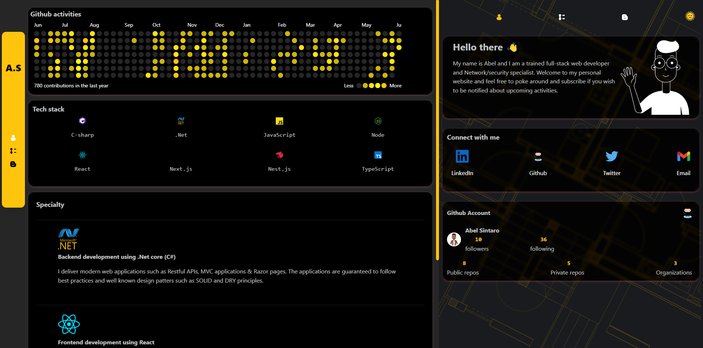
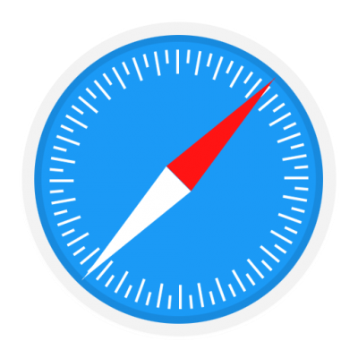

# My Portfolio Website



This is a personal website to showcase my work and daily activities. The website is made using [Nextjs v.12](https://nextjs.org/blog/next-12). Currently the website shows my daily activities on github as well as previous work experiences, timeline, and my tech stacks.

## Packages

- React `17.0.2`
- Next `12.1.6`
- Framer-motion `6.3.10`
- Cookies-next `2.0.4`
- React-redux `8.0.2`
- Reduxjs/toolkit `1.8.2`
- Axios `0.27.2`
- Mantine/next `4.2.8`
- Mantine/core `4.2.7`
- Mantine/hooks `4.2.7`

## Instruction on running project

1. Download or clone this repository to your local machine and change your working directory to the repository directory.

```
$ git clone <repo-url>
$ cd <repo-directory>
```

2. Copy the `.env.example` file to `.env.local` file. Change the values in the file accordingly.

3. Run the following command:

```
$ npm run dev
```

4. Now your endpoints should be available on [http://127.0.0.1:3000/](http://127.0.0.1:3000/).

## Browser Support

Currently, This site officially aim to support the last two versions of the following browsers:

   
